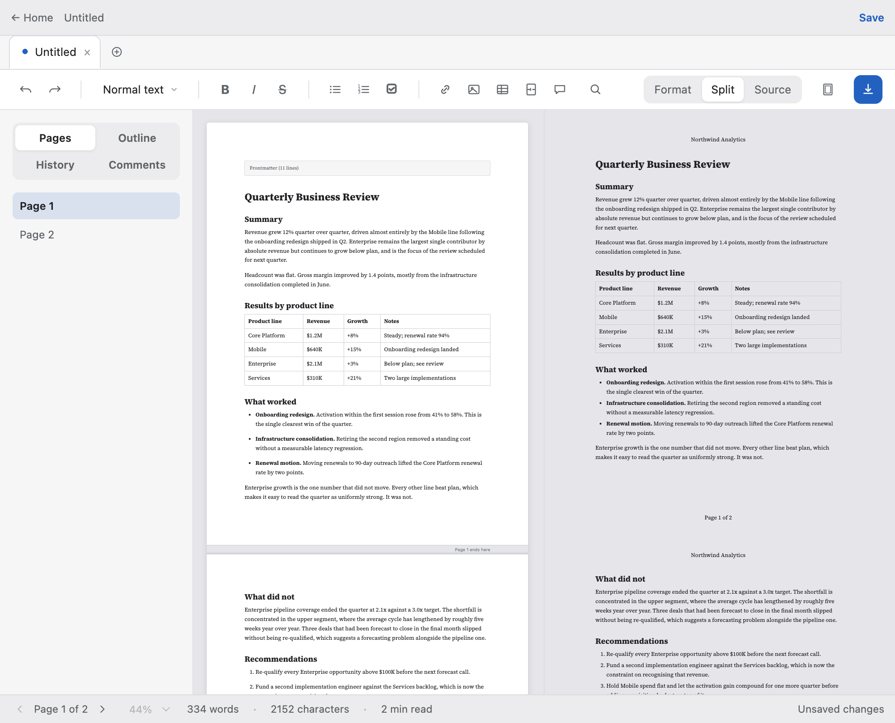
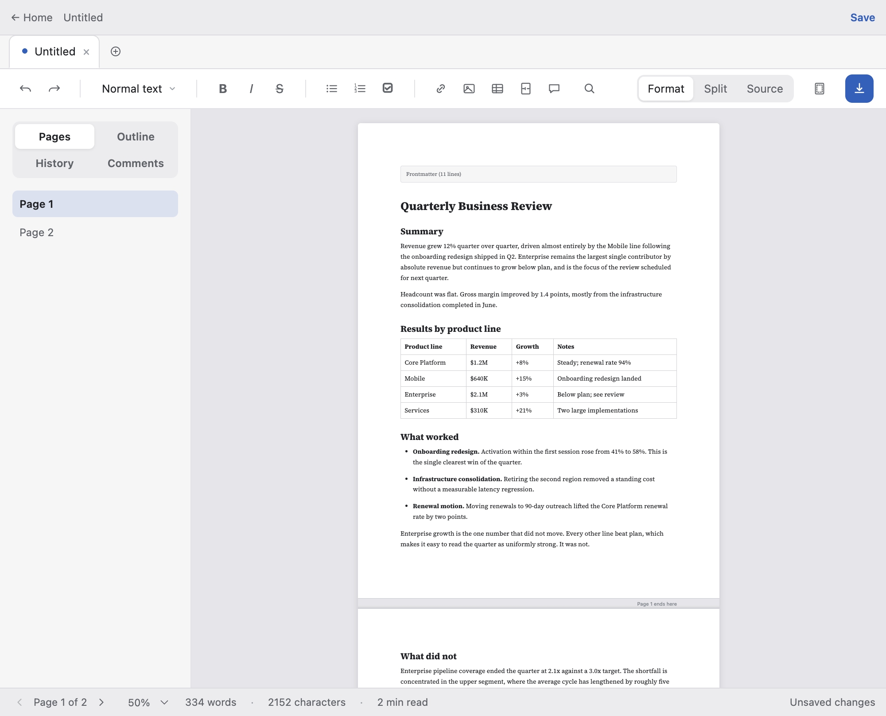
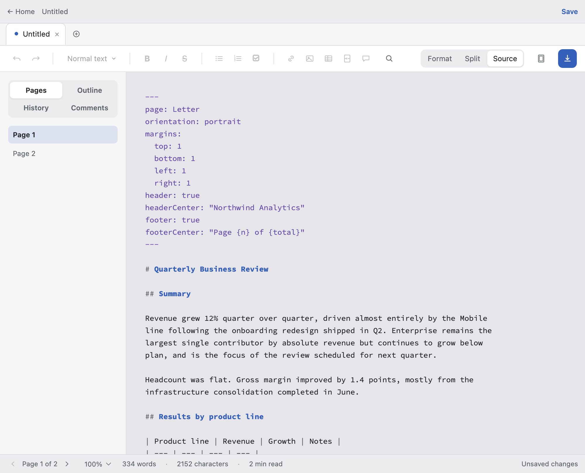
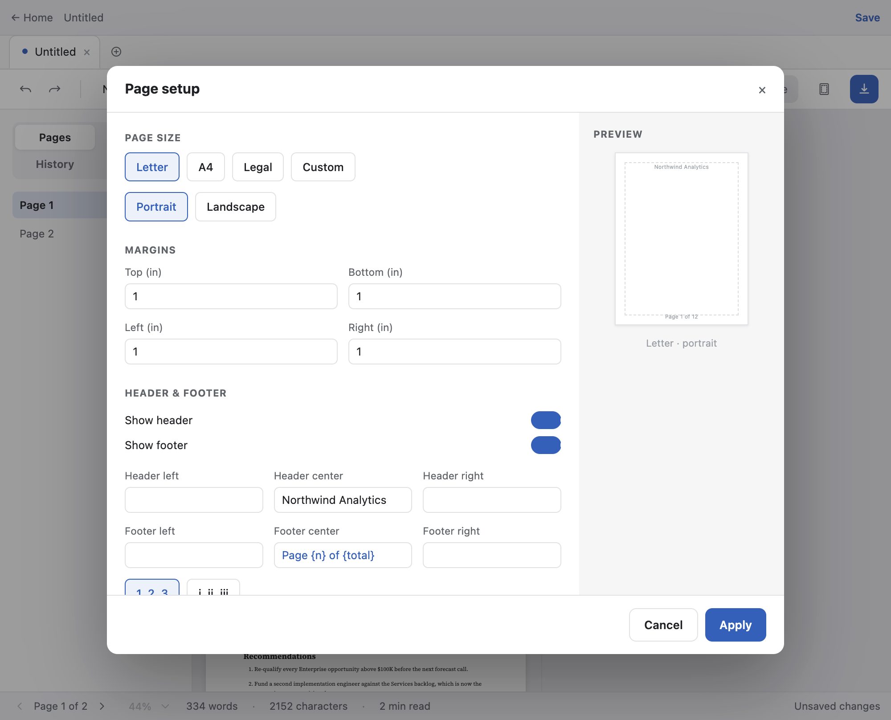
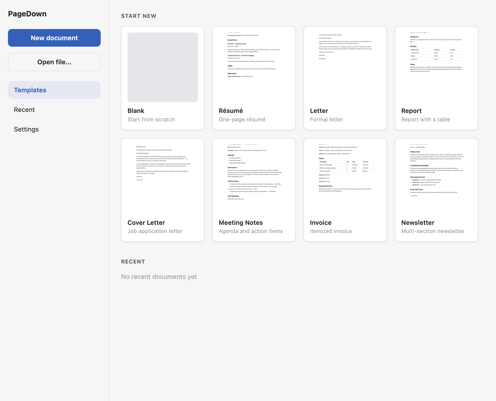

<div align="center">

# PageDown

**A page-first Markdown editor for documents that get printed.**

Pages are the primary editing unit, the way they are in a word processor — but
the file on disk is real, portable Markdown.

[](https://github.com/kenduck1/PageDown/actions/workflows/ci.yml)
[](LICENSE)
[](https://github.com/kenduck1/PageDown/releases)



</div>

## Why

Most Markdown editors are a continuous scroll that only discovers where the
pages fall when you export. That is fine for a blog post and unhelpful for a
résumé, a letter, or a report someone is going to print — the documents where
the page _is_ the unit you are designing.

The usual alternative is to give up Markdown: use Word, or a custom markup
language like LaTeX or Typst. PageDown tries the third option.

- **You see pages while you edit.** Real page boundaries in the canvas, drawn
  from the same pagination engine that produces the PDF — never independently
  computed, because two pagination algorithms disagree exactly where it
  matters.
- **The preview and the export are the same render.** PDF export drives the
  same sandboxed Paged.js context as the live preview, so they are consistent
  by construction rather than by effort.
- **The file stays portable.** Page size, margins, headers and footers live in
  YAML frontmatter. Page breaks, comments, tables of contents and image sizing
  use HTML-comment and attribute conventions that other Markdown renderers
  ignore harmlessly. Open the same file anywhere else and it is still just
  Markdown.

> [!NOTE]
> PageDown is early-stage and under active development — expect rough edges.
> Known gaps, named up front: builds are **not signed or notarized** and there
> is **no auto-update**; a never-saved document is crash-protected by a draft
> store but has no version history; and Split mode's panes follow each other
> by page rather than scrolling in exact sync.

## Screenshots

<table>
<tr>
<td width="50%">

**Format** — a WYSIWYG canvas with real page boundaries.



</td>
<td width="50%">

**Source** — the exact bytes, syntax-coloured.



</td>
</tr>
<tr>
<td width="50%">

**Page Setup** — size, margins, running headers and footers, written back to
the document's own frontmatter.



</td>
<td width="50%">

**Home** — templates and recent documents, with real rendered thumbnails.



</td>
</tr>
</table>

## Features

**Editing**

- Three modes: **Format** (WYSIWYG), **Source** (raw Markdown), and **Split**
  (editor plus live paginated preview, side by side)
- Formatting toolbar, a `/` slash palette for inserting blocks, and a
  selection bubble menu with full table row/column/alignment editing
- Find & Replace across whichever surface is live
- Comments, stored inline in the Markdown with no sidecar file
- Tabs, multi-window, an outline sidebar, word and character counts

**Layout**

- Page size (Letter, A4, Legal, Custom), orientation and per-side margins
- Running headers and footers with real page numbering (`{n}` / `{total}`,
  decimal or roman)
- Typography themes and document fonts
- Page breaks via `<!-- pagebreak -->`, also recognising `\newpage` and
  `\pagebreak` — and round-tripping whichever spelling you wrote
- A table of contents via `<!-- toc -->` or `[TOC]`, with **real page numbers**

**Markdown**

- GitHub Flavored Markdown: tables, task lists, footnotes, strikethrough
- Syntax-highlighted code fences
- Mermaid diagrams and KaTeX math
- Image sizing (`{width=50%}`) and drag-to-resize
- Images by drag-and-drop or file picker

**Output**

- **PDF export** and **native printing**, both through the same render context
  as the preview
- **HTML export** that is genuinely self-contained — fonts embedded, local
  images inlined
- **Word (.docx) export**

**Desktop citizenship**

- A real application menu with the shortcuts you would expect
- `.md` file associations, single-instance lock, persisted window bounds
- Autosave with crash recovery and version history
- A prompt before closing or quitting with unsaved work
- App-level dark mode — chrome only; document content always renders light,
  matching what actually prints

## Installing

Download the latest build from the
[Releases page](https://github.com/kenduck1/PageDown/releases).

| Platform              | File                                           |
| --------------------- | ---------------------------------------------- |
| macOS (Apple Silicon) | `pagedown-<version>-arm64.dmg`                 |
| macOS (Intel)         | `pagedown-<version>-x64.dmg`                   |
| Windows               | `pagedown-<version>-setup.exe`                 |
| Linux                 | `pagedown-<version>-x86_64.AppImage` or `.deb` |

> [!WARNING]
> **Builds are unsigned.** PageDown has no Apple Developer ID or Windows
> Authenticode certificate, so both operating systems will warn you. This is a
> real gap, not a formality — only bypass these warnings for a build you
> obtained from the Releases page above.

**macOS.** Gatekeeper will report that the app "is damaged and can't be
opened", which is what it says for any unsigned, un-notarized app carrying a
download quarantine flag. To run it anyway:

```bash
xattr -dr com.apple.quarantine /Applications/PageDown.app
```

**Windows.** SmartScreen will show "Windows protected your PC". Choose **More
info → Run anyway**.

**Linux.** Make the AppImage executable (`chmod +x pagedown-*.AppImage`), or
install the `.deb` with `sudo dpkg -i pagedown_*.deb`.

## Signing macOS releases (maintainers)

Releases are unsigned until a Developer ID certificate is configured, which is
why macOS reports the app as damaged. The release workflow signs and notarizes
automatically once these secrets exist, and builds unsigned when they do not —
no workflow edit is needed either way.

One-time setup, two steps:

**1. Let Xcode create the certificate.** Xcode → Settings → **Accounts** → add
your Apple ID → select the team → **Manage Certificates…** → **+** →
**Developer ID Application**.

Xcode generates the key, requests the certificate, and installs it with the
full chain. No certificate signing request to build by hand.

> Pick **Developer ID Application**, not "Mac App Distribution" — only
> Developer ID works for software shipped outside the Mac App Store.

**2. Upload the secrets:**

```bash
./scripts/setup-mac-signing.sh
```

With no argument it exports the certificate straight from your keychain
(macOS will ask for your login password), then asks for an **App Store Connect
API key** for notarization — create one at
[appstoreconnect.apple.com](https://appstoreconnect.apple.com) → Users and
Access → **Integrations** → App Store Connect API. The `.p8` downloads exactly
once.

An API key is used rather than an Apple ID and app-specific password (both work
with electron-builder) because it is a standalone credential: revocable on its
own, and not derived from the account that owns the enrollment.

The script never echoes a value, and the exported certificate copy is deleted
on exit.

That is all. **Notarization is not a separate step** — the workflow enables it
whenever the secrets are present, and electron-builder submits to Apple and
staples the ticket during the build. It adds a few minutes.

<details>
<summary>Without Xcode</summary>

Two scripts cover the manual route. They exist because doing this by hand has
one non-obvious failure: the `.p12` must carry Apple's **Developer ID
intermediate** certificate, which Keychain Access supplies for free and a
hand-rolled export does not. Omitting it yields a signature that looks fine
locally and is rejected at notarization.

```bash
./scripts/make-signing-request.sh "you@example.com" "Your Name"
# upload the .certSigningRequest at developer.apple.com, download the .cer
./scripts/build-signing-p12.sh ~/Downloads/developerID_application.cer
./scripts/setup-mac-signing.sh ~/.pagedown-signing/DeveloperID.p12
```

`build-signing-p12.sh` fetches the intermediate and verifies the chain before
building, so a wrong certificate fails in seconds rather than at notarization.

</details>

Then tag a release as usual. The run summary reports whether the built app is
**actually** signed — read off the artifact with `codesign`, not inferred from
the secrets existing.

> [!NOTE]
> Signing embeds the certificate's common name — `Developer ID Application:
<NAME> (<TEAMID>)` — in every build, readable by anyone via
> `codesign -dv --verbose=4`. That is the mechanism, not a leak: Gatekeeper's
> purpose is telling users who signed the software. For an individual
> enrollment that name is a legal name; an organization enrollment shows the
> company name instead. Nothing else from the Apple account is embedded.

## Building from source

Requires [pnpm](https://pnpm.io) — the version is pinned in `package.json`.

```bash
pnpm install
pnpm dev            # run in development

pnpm build          # typecheck -> bundle -> pagination render context
pnpm build:mac      # package for macOS
pnpm build:win      # package for Windows
pnpm build:linux    # package for Linux (AppImage / deb / snap)
```

## Development

```bash
pnpm verify         # typecheck + lint + unit tests — what CI checks
pnpm test:gates     # Playwright, against the real built app

pnpm typecheck      # main process + renderer (two separate tsconfigs)
pnpm lint
pnpm format
pnpm test:unit      # Vitest
```

Requires Node 22 (`.nvmrc`).

`docs/screenshots/` is regenerated from the real app with:

```bash
pnpm build && pnpm exec tsx scripts/capture-screenshots.ts
```

See **[ARCHITECTURE.md](ARCHITECTURE.md)** for how the app is put together —
the three execution contexts, the sandboxed render context and why it exists,
the Markdown pipeline's ordering rules, and the editor/paginator parity
invariant. It is worth reading before a substantial change: several of those
invariants fail silently when broken.

## Contributing

Bug reports and fixes are welcome. See
**[CONTRIBUTING.md](CONTRIBUTING.md)**.

The single most useful thing in a bug report is the minimal Markdown document
that reproduces the problem, including its frontmatter, plus which editing
mode you were in.

For security issues, please see **[SECURITY.md](SECURITY.md)** and report
privately rather than opening an issue.

## Licence

[MIT](LICENSE).

PageDown bundles three typefaces under the SIL Open Font License 1.1 —
**Source Serif 4**, **Inter**, and **Source Code Pro** — with their licences
in `src/renderer/src/assets/fonts/`. It builds on
[Paged.js](https://pagedjs.org/), [Milkdown](https://milkdown.dev/) /
[ProseMirror](https://prosemirror.net/),
[unified](https://unifiedjs.com/)/remark,
[Mermaid](https://mermaid.js.org/) and [KaTeX](https://katex.org/).
