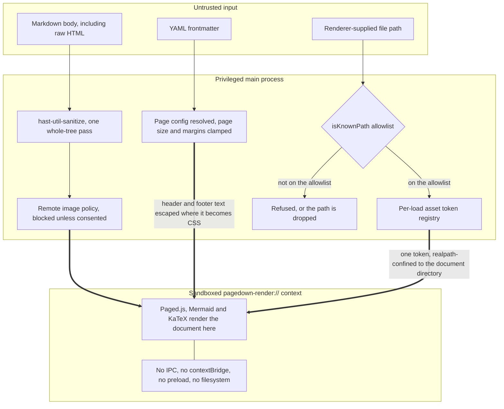
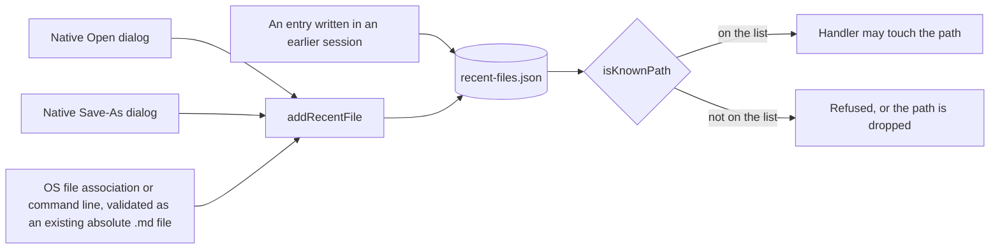

# Security Policy

## Reporting a vulnerability

Please report security issues privately, via GitHub's
[private vulnerability reporting](https://github.com/kenduck1/PageDown/security/advisories/new)
on this repository. Do not open a public issue.

Include what you would need to reproduce it: a document or file that triggers
the behaviour, the platform, and the version. If a proof of concept touches
the filesystem or the network, please describe rather than demonstrate against
anything you do not own.

This is a small project and there is no formal SLA. Expect an acknowledgement
within a week.

## Supported versions

PageDown is pre-1.0. Only the latest release receives fixes.

## Threat model

PageDown opens `.md` files, and a Markdown file is untrusted input — it can be
downloaded, emailed, or checked out from someone else's repository, and it can
contain arbitrary raw HTML. The interesting boundaries are therefore between
_document content_ and _the machine it is opened on_.

Untrusted input arrives in three forms, and each crosses a boundary with its
own enforcement point before anything renders:

Document HTML only ever reaches the sandboxed context, and it arrives already
sanitized. Nothing in that context can call back into the main process.

### What the app defends against

**Document content executing with privilege.** All document rendering —
including Paged.js, Mermaid diagrams and KaTeX math — happens in a sandboxed,
separate-origin context served from a custom `pagedown-render://` scheme, with
no IPC, no `contextBridge` surface and no filesystem reach. Rendering document
HTML in a context that also had disk access would turn a hostile
`` into a local file read or write. The privileged app-shell
renderer never renders Mermaid or KaTeX at all.

**Arbitrary file read or write via IPC.** Every `file:*` IPC handler that
accepts a renderer-supplied path validates it against an allowlist
(`isKnownPath`). A path is trusted only if it came from a real native file
dialog, is already in the persisted recents list, or was delivered by the
operating system through a file association — none of which a renderer can
forge. Two real vulnerabilities of exactly this shape existed before that
check was added.

The allowlist is the persisted recents list itself, and only three code paths
write to it — all three requiring either a real dialog the user drove or a
path the operating system handed the app directly:

Handlers differ in what they do on a miss. Opening a path throws, because the
path is the whole request; page counting and the live preview drop it and
continue with local assets denied, so a document that has aged out of the
ten-entry list still renders.

**Filesystem traversal via document-referenced assets.** Local images resolve
only through a per-call token registry. Paths are symlink-resolved with
`fs.realpath` on both sides, absolute paths and `..` escapes are denied, a size
cap is enforced with `stat` before any read, and content type comes from
sniffing real magic bytes rather than the file extension. Assets are served
with `X-Content-Type-Options: nosniff` and a `default-src 'none'; sandbox`
CSP. All denials return the same undifferentiated result, so a hostile
document cannot use timing or error differences as a filesystem oracle.

**Silent network callbacks.** Remote images are blocked by default, per
document, and require explicit per-session consent. `connect-src` is `'none'`
in the sandboxed context, so script-initiated fetch, XHR and WebSocket are
unavailable there regardless.

**Snapshot path traversal.** Version-history snapshot IDs are validated
against a strict anchored pattern before any filesystem path is built from
one.

**Forged document structure.** The page-break marker's sanitizer exception
matches a per-render random token rather than the public class name, so a
document's own raw HTML cannot forge a real page break.

### What is out of scope

- **Builds are unsigned.** There is no Apple Developer ID or Windows
  Authenticode certificate, and macOS notarization is off. Verify what you
  download. This is a known gap, not a claim of safety.
- **There is no auto-update mechanism**, so there is no update channel to
  compromise — and equally, no automatic delivery of security fixes. Watch
  releases.
- **Denial of service from pathological documents.** Margins are clamped
  specifically to prevent a frontmatter typo producing an effectively infinite
  page count, and KaTeX's `maxSize` is bounded, but a sufficiently
  adversarial document can still make rendering slow.
- **The `__pagedownPhase0` test bridge** is gated to development builds and is
  absent from packaged releases. If you find it in a packaged build, that is
  a bug worth reporting.
- Attacks requiring an already-compromised machine, or physical access.
