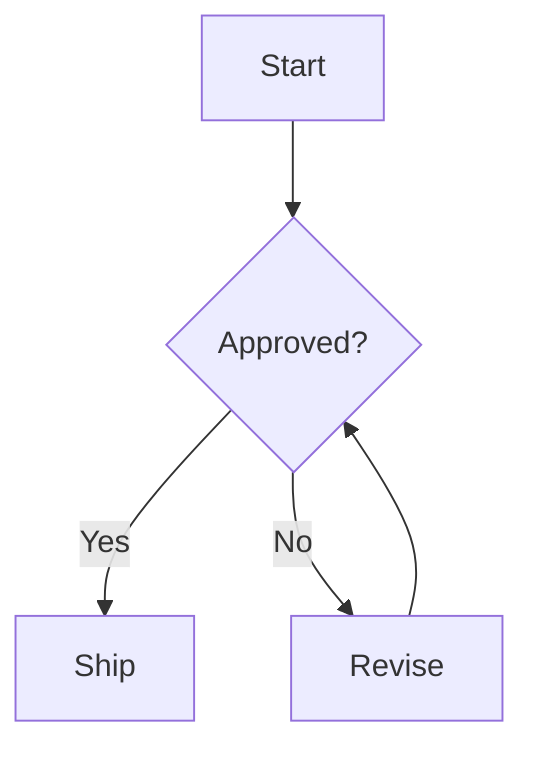
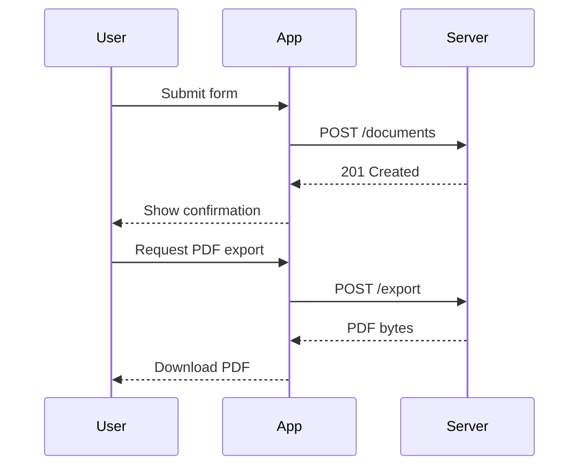
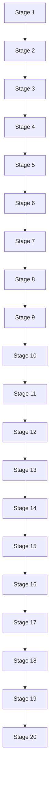

# Small Flowchart

```mermaid
flowchart TD
  A[Start] --> B{Approved?}
  B -->|Yes| C[Ship]
  B -->|No| D[Revise]
  D --> B
```

# Larger Sequence Diagram

```mermaid
sequenceDiagram
  participant U as User
  participant A as App
  participant S as Server
  U->>A: Submit form
  A->>S: POST /documents
  S-->>A: 201 Created
  A-->>U: Show confirmation
  U->>A: Request PDF export
  A->>S: POST /export
  S-->>A: PDF bytes
  A-->>U: Download PDF
```

# Oversized Diagram

```mermaid
flowchart TD
  A[Stage 1] --> B[Stage 2]
  B --> C[Stage 3]
  C --> D[Stage 4]
  D --> E[Stage 5]
  E --> F[Stage 6]
  F --> G[Stage 7]
  G --> H[Stage 8]
  H --> I[Stage 9]
  I --> J[Stage 10]
  J --> K[Stage 11]
  K --> L[Stage 12]
  L --> M[Stage 13]
  M --> N[Stage 14]
  N --> O[Stage 15]
  O --> P[Stage 16]
  P --> Q[Stage 17]
  Q --> R[Stage 18]
  R --> S[Stage 19]
  S --> T[Stage 20]
```
